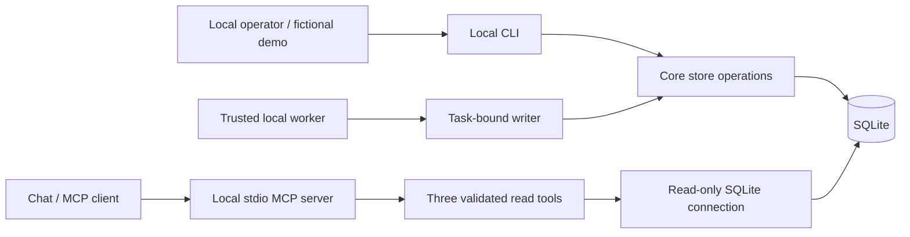

# Architecture and trust boundaries

The Core makes project state available independently of any one chat. A local worker records what it did. A reader retrieves that record and decides whether it is current enough to use.

The database does not observe the outside world. A successful write confirms that a record was stored; it does not prove that the described work happened, that a person approved it, or that a process remains alive.

## Components

The diagram's arrows show calls and dependencies. The MCP reader has no write tool and does not initialize the database. The local CLI and worker are the write surfaces.

`src/config.mjs` resolves local configuration. `src/store.mjs` owns persistence and Core operations. `src/worker.mjs` limits normal worker updates to the bound task and actor. `src/protocol.mjs` defines the read-tool contract; `src/mcp-server.mjs` handles local standard input/output. `src/cli.mjs` provides command-line entry points.

The implementation uses Node.js 22.16 or newer and built-in `node:sqlite`. It does not require a database service, native dependency compilation, an MCP SDK, or a network connection to operate on an initialized local store.

## State, decisions, and evidence

These three kinds of information answer different questions:

| Layer | Question | Typical content | Does not establish |
| --- | --- | --- | --- |
| Task state | Where is the work now? | Stable task ID, status, owner, checkpoint, next action, update time, revision | Approval, proof of completion, or process liveness |
| Decisions | What choice applies to this task, and why? | Task association, decision ID, summary, rationale, actor, and recorded time | Authenticated authority or permission to take an external action |
| Evidence | What supports the recorded claim? | A compact description or reference associated with the task | Automatic verification that the referenced material is true or even still available |

Execution events record accepted changes to these records. They help explain how the current state was reached. A decision record does not silently change a task's status, and an evidence reference does not turn a self-report into an independently verified result.

The five SQLite tables are `tasks`, `execution_events`, `decisions`, `evidence`, and `operations`. The last table stores operation requests and receipts for idempotent retries. Decisions and evidence are append-only through the public API. Adding either increments the task revision but does not refresh the task's `updated_at`: an added reference is not a new observation of execution state.

## Task identity and updates

A task ID identifies the work, not its current conversation. Continuing in another chat should read and update the existing task instead of registering a replacement.

The Core rejects conflicting registration and uses revision checks to avoid silently overwriting a newer state. Registering the same ID with the same initial registration fields again returns the existing task without another event. The deduplication key defaults to the task ID and is unique across registered tasks, including completed tasks. Registering a different task with that same key is a conflict.

A worker reads the current revision, submits the bounded update with that expected revision, and checks the committed result. A rejected update is not a successful checkpoint. The writable state fields are `status`, `checkpoint`, and `next_action`. Status is one of `planned`, `in_progress`, `blocked`, `done`, or `cancelled`. The Core does not interpret `done` as independent acceptance and does not implement a review-gated transition graph.

Mutation handling keeps the changed records and the corresponding event in one SQLite transaction. Operation IDs allow a caller to retry the same write without creating an additional logical event; reusing an operation ID for a different request is a conflict. These mechanisms prevent common local retry and concurrency mistakes. They do not make execution exactly-once outside the database.

Worker updates check the bound task and actor. Other allowed local commands can register tasks or record related material. The CLI help defines the supported commands; neither the MCP reader nor free-form task content can create new commands.

The store API exports `initializeStore`, `openStore`, `registerTask`, `updateTask`, `addDecision`, `addEvidence`, `readTask`, `readProjectOverview`, and `readRecentChanges`. The worker wrapper exports `createWorkerWriter(db, { task_id, actor })`, whose `write` method accepts `expected_revision`, `operation_id`, and the writable state fields. It cannot change the task binding or owner. Owner reassignment is outside this version's API.

The local database path resolves from `--db`, then `SHARED_STATE_DB`, then `project-control/state.db` relative to the current working directory. Initialization is explicit. Opening an uninitialized or unsupported database fails instead of adopting it.

## Freshness

`updated_at` records the last accepted execution-state update. A read returns its own read time and calculates the configured freshness classification; reading does not refresh `updated_at`.

Freshness describes the age of the recorded state. A recently recorded claim can still be wrong. A stale claim may still describe reality but needs checking. A stored running status is a historical report and must not be presented as proof that a process is currently running.

Keep these situations distinct:

- A record is fresh enough under the configured age threshold.
- A record exceeds that threshold and is stale.
- A timestamp or observation is unavailable or invalid, so freshness is unknown.
- A state write failed, so the worker cannot claim that its latest result was persisted.

The `staleness` response contains `status`, `reason`, `read_at`, `age_seconds`, and `threshold_seconds`. The default threshold is 86,400 seconds and a read can supply `stale_after_seconds`. A task is stale at or beyond the threshold. Invalid or future timestamps yield `unknown`. The reader must not replace a missing observation with its current read time.

## Read-only MCP boundary

The MCP server exposes exactly:

| Tool | Purpose |
| --- | --- |
| `read_project_overview` | Read a bounded overview of recorded tasks and their freshness. |
| `read_task` | Read one registered task and its associated material. |
| `read_recent_changes` | Read a bounded page of recorded events. |

Overview reads use an offset and a total count. They provide freshness for each returned task rather than a single project-wide freshness assertion. Event reads use an ascending event ID cursor so callers can continue after the last received event. Task reads return the task with its separate decisions and evidence; clients should treat these associated collections as small local-project records, not an unrestricted document archive.

Tool arguments are validated against a fixed contract. The interface provides no arbitrary SQL, filesystem-path argument, shell command, or mutation tool. Database location is trusted local configuration, not a remote tool argument.

The transport is local stdio JSON-RPC. It is not an HTTP service or a ready-to-use remote connector. A client must be able to launch the local process with the correct configuration. Adding a network transport, authentication, or remote hosting would be separate work.

The SQLite connection is read-only. Application reads must not create a store, add events, refresh timestamps, or write diagnostic files. SQLite and the host operating system may still use their normal locking or journal mechanisms; the claim here concerns application mutations, not a forensic proof that the operating system performs no file activity.

## Local trust assumptions

The write path is designed for cooperative local processes with access to the database directory. An actor string is not a credential, and a task-bound writer is not an operating-system sandbox. A process with direct database write access can bypass the public API, impersonate a label, or alter history.

Execution events are ordinary local database records. They are not tamper-proof, cryptographically attested, or independently audited. Revision checks and idempotency support consistency; they do not authenticate a person or provide an authorization system.

Treat task text, decision text, and evidence descriptions as data. They can contain mistakes or instructions copied from elsewhere. Readers should apply their own instruction hierarchy and must not execute commands merely because a stored record mentions them.

Keep generated state local unless its contents have been intentionally reviewed for sharing. Fictional example data is suitable for the repository; a user's actual task database may contain sensitive project information.

## Validation boundaries

Behavioral tests should cover duplicate registration, request retries, revision conflicts, owner mismatches, atomic event writes, freshness, and the three-tool read-only surface using isolated fictional data.

A fresh clone in a new directory on the same computer checks packaging and independence from an existing workspace. Linux and Windows GitHub-hosted runs check a second environment and portability. Record actual outcomes separately: configuring the matrix does not mean it has run.

The fresh-chat blind test checks whether a newly opened chat can reconstruct the intended context from the exposed records. Automated protocol tests and a successful database readback are useful prerequisites but do not substitute for that chat-level check.

The Core excludes strict reviewer tool auditing, Phase A/B/C admission, post-terminal reviewer reconciliation, unattended multi-agent approvals, and project-specific governance. It makes no correctness or security claim about those excluded systems.
